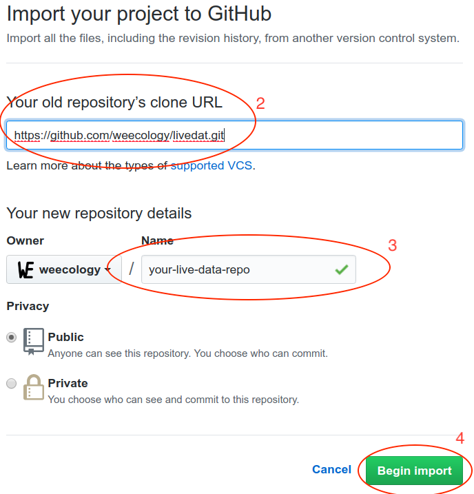
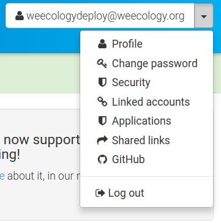
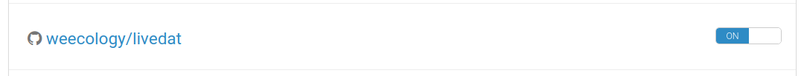

# livedat

Template and instructions for creating a living data workflow.

1. Clone the repository
2. Configure the repository for your project
3. Connect to Zenodo
4. Connect to Travis
5. Implement your data cleaning and manipulation steps
6. Some thoughts on security

This assumes a basic knowledge of git and GitHub.

## Make a copy of this repository

You want your own version of this repository to build on. The easiest way to do
this is to use the GitHub import tool:

https://github.com/new/import

1. Copy the clone url for this repo: https://github.com/weecology/livedat.git
2. Paste it into the "Your old repository’s clone URL" box on the import page
3. Choose a name for you new repository
4. Click "Begin import"

After a few minutes 

## Configure the repository for your project

1. Open the `config.yml` file in the root of the repository
2. Change the repo name to that for your project. This should be the GitHub user
   or organization name followed by the repository name. You can get this by
   removing the "https://github.com/" from the url for your repository.
3. Change the deploy email and username. These values will identify the user
   that is shown as making the automated commits. Generally you want these to be
   different from your user account so it is clear which commits are
   automated. You don't need a GitHub account for this user, this is just the
   name and email that will appear in the commit log.
4. Commit and push these changes to your GitHub repository.

## Connect to Zenodo

1. In a browser go to https://zenodo.org/
2. If you're new to Zenodo
    1. Click the "Sign Up" button and choose "Sign Up with GitHub"
    2. Click on "Authorize Zenodo" and enter your GitHub password
    3. Confirm your account by clicking the link in the confirmation email
3. Login to Zenodo
4. In the top right corner of the screen click the down arrow next to your email
   address and select "GitHub"
   
   
   
5. Find your repository in the list and flip the switch to "On"

   
