# livedat

Template and instructions for creating a living data workflow.

1. [Clone the repository](#copyrep)
2. [Configure the repository for your project](#configrepo)
3. [Connect to Zenodo](#connectzendo)
4. [Connect to Travis](#connecttravis)
5. [Give Travis access to update your data on GitHub](#travisaccess)
6. [Implement your data cleaning and manipulation steps](#datacleaning)
7. [Some thoughts on security](#security)

This assumes a basic knowledge of git and GitHub, and an active GitHub account.

## Make a copy of this repository <a name="copyrepo"></a>

You want your own version of this repository to build on. The easiest way to do
this is to use the GitHub import tool:

https://github.com/new/import

1. Copy the clone url for this repo: https://github.com/weecology/livedat.git
2. Paste it into the "Your old repository’s clone URL" box on the import page
3. Choose a name for you new repository
4. Click "Begin import"


5. After the import is finished (typically a few minutes) navigate to your copy
   of the repository
6. If you want to work with it locally clone the repository

## Configure the repository for your project <a name="configrepo"></a>

1. In the root directory of the repository open the `config.yml` file
2. Change the repo name to that for your project. This should be the GitHub user
   or organization name followed by the repository name. You can get this by
   removing the "https://github.com/" from the url for your repository.
3. Change the deploy email and username. These values will identify the user
   that is shown as making the automated commits. Generally you want these to be
   different from your user account so it is clear which commits are
   automated. You don't need a GitHub account for this user, this is just the
   name and email that will appear in the commit log.
4. Commit and push these changes to your GitHub repository.

## Connect to Zenodo <a name="connectzendo"></a>

1. In a browser go to https://zenodo.org/
2. If you're new to Zenodo
    1. Click the "Sign Up" button and choose "Sign Up with GitHub"
    2. Click on "Authorize Zenodo" and enter your GitHub password
    3. Confirm your account by clicking the link in the confirmation email
3. Login to Zenodo
4. In the top right corner of the screen click the down arrow next to your email
   address and select "GitHub"
   
   
   
5. Find your repository in the list and flip the switch to "On"

   

## Connect to Travis <a name="connecttravis"></a>

1. Go to https://travis-ci.com/ and click the green button to sign up with GitHub

   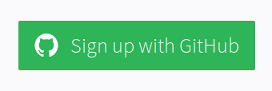
   
2. Authorize Travis to access your GitHub account by clicking the green button

   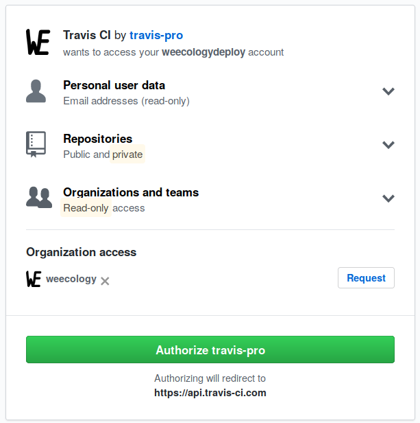

3. Activate GitHub Apps by clicking the green button

   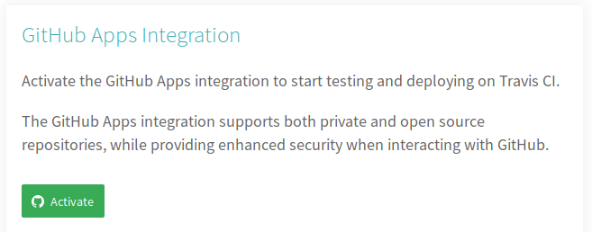

4. Select the repository you want to use using the `Select Repositories`
   dropdown menu

   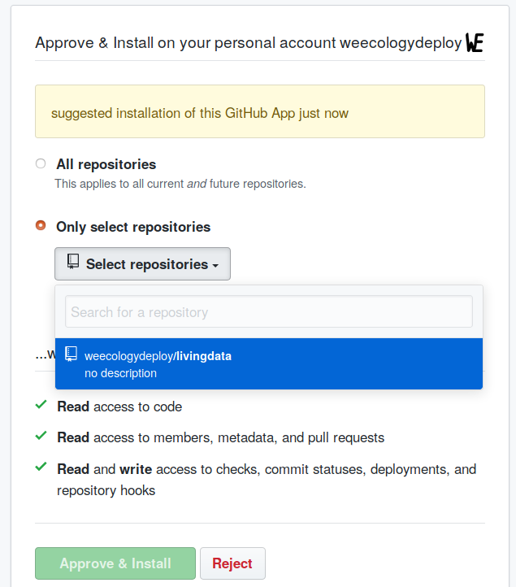

5. Approve access to that repository by clicking the green `Approve & Install`
   button
   
   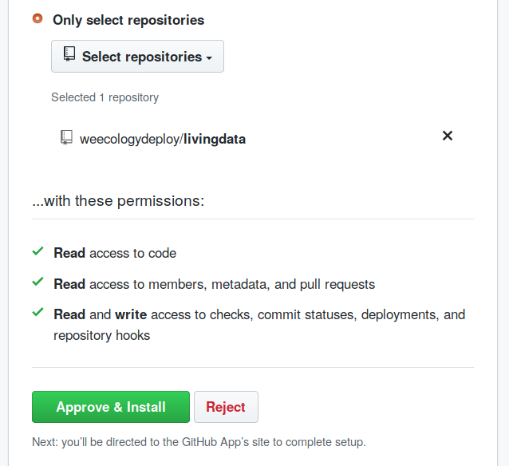

6. You will be redirected to Travis. Click the `Sign in with GitHub` button and
   you're done.
   
   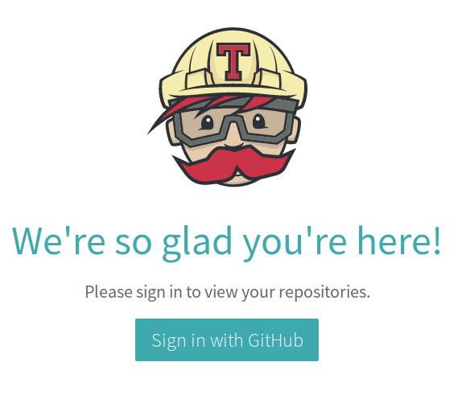

## Give Travis access to update your data on GitHub <a name="travisaccess"></a>

This set of steps creates a "Personal Access Token" that works like a password
for you GitHub account. Someone with access to this token would be able to use
it to change most of the core things in your repositories.

1. Select `Settings` from the https://github.com menu

   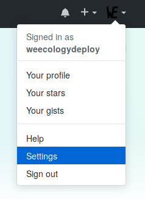

2. Select `Developer Settings` from the bottom of the `Personal settings` menu on
   the left of the screen

   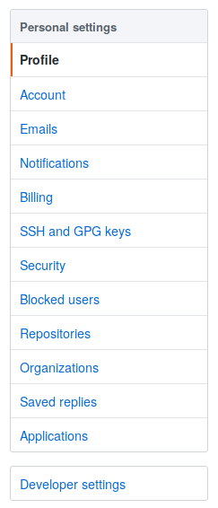

3. Select `Personal access tokens` from the bottom of the menu on the left of
   the screen

   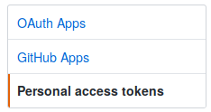

4. Click the `Generate new token` button in the top right of the screen

   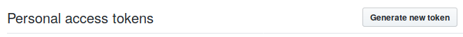

5. Enter a clear description of the use of this connection in the `Token description` box

   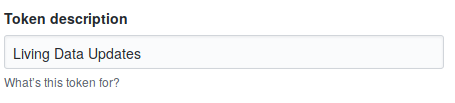

6. Click the `repo` scope check box

   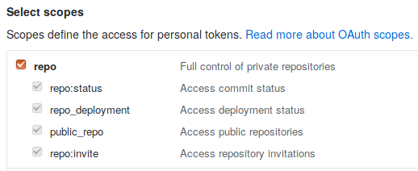

7. Click the `Generate token` button at the bottom of the screen

   

8. Click the copy icon to the right of the long string of letters and numbers in
   the green box

   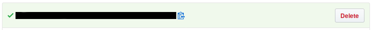

9. Go to https://travis-ci.com/ and choose your data repository from the `My Repositories` list on the left side of the screen

   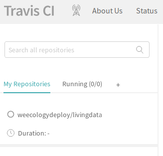

10. Click the `More options` menu on the right side of the screen and select
    `Settings`

   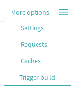

11. In the `Environment Variables` section enter `GITHUB_TOKEN` in the `Name`
    box and paste the token you copied from GitHub into the `Value` box.

   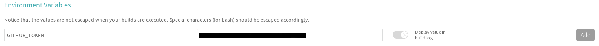

12. Click the `Add` button at the right edge of this section

   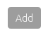

## Implement your data cleaning and manipulation steps <a name="datacleaning"></a>

1. Add any packages that your data cleaning and manipulation requires to
   `p_load` function call in `install-packages.R`. Do not remove any of the
   packages that are already there.
   
    ```
    # Install packages required for analysis
    # Add any packages required for you data cleaning and manipulation to the
    # `p_load` function call below
    # Do not remove the packages already listed here
    # they are important for running the livedat repository
    
    pacman::p_load(git2r, httr, semver, yaml, dplyr)
    ```
2. Modify `datascript.R` to the code you need for data cleaning and manipulation
3. Commit and push these changes to your repository

## Some thoughts on security <a name="security"></a>
